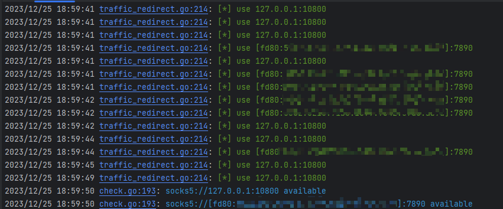

## komoproxy

go编写的 socks5代理池轮切工具，支持ipv6代理，支持fofa采集代理，支持导入自定义的socks5代理文件。

### 特点

- 支持认证
- 代理优选策略：随机、或延时前多少个随机选择
- 一个tcp连接一个代理
- 支持指定自定义的socks5代理
- 支持fofa采集代理

### 使用

```go
.\kproxy.exe -h
Usage 
  -listen string
        listen address (default "0.0.0.0:8899")
  -mode int
        mode 1 proxy from proxyfile,mode 2 proxy from fofa,mode 3 proxy from proxyfile and fofa (default 3)
  -pass string
        authentication password
  -pc int
        the page count you want to crawl (default 5)
  -pf string
        socks5 proxy file (default "proxy.txt")
  -ps int
        the page size you want to crawl (default 100)
  -strategy int
        0: random, 1: select the one with the shortest timeout, 2: select the two with the shortest timeout, ... (default 3)
  -t int
        number of threads detecting whether the agent is alive (default 10)
  -user string
        authentication username

```

其他配置可以通过config.ini添加，初次运行自动生成config.ini

```go
[listen]
listenaddr = 0.0.0.0:8899
username =
password =

[fofa]
;可空可写
email = xxx
key = xxx
;fofa rule
rule =
;query proxy
proxy =
pagesize = 100
pagecount = 5

[config]
;可空可写，默认百度检测代理是否可用
checkurl =
;检测关键词
checkwords =
;不需要配置
ipregionflag = 0
;随机在延迟前x内选择一个代理
strategy = 3
;自己导入的socks5代理配置文件
proxyfile = "proxy.txt"
; 支持三种模式，mode 1 proxy from proxyfile,mode 2 proxy from fofa,mode 3 proxy from proxyfile and fofa
mode = 1
;代理探活
threads = 10
```


### 效果展示

